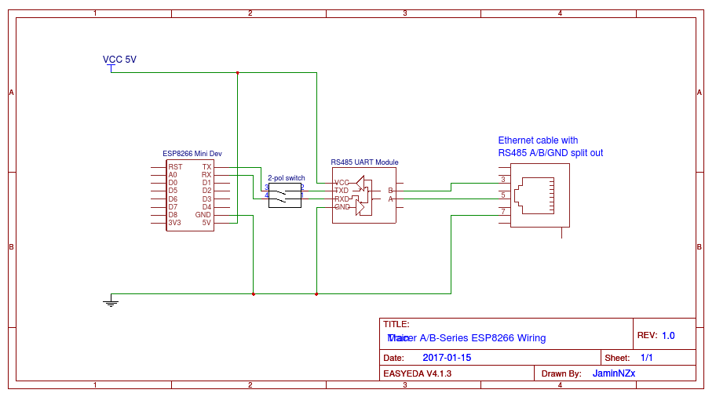
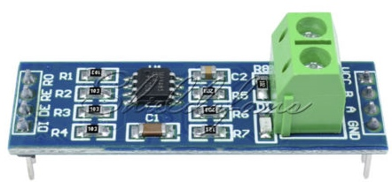

# Tracer-RS485-Modbus-Blynk V2.0

This is almost complete rewrite of the original [project](https://github.com/jaminNZx/Tracer-RS485-Modbus-Blynk), with ton of improvements, refactored code, brand new Blynk project, and wider compatibility of RS485 converters.

## Info

An Arduino project to connect the **EPSolar/EPEver Tracer A/B Series MPPT Solar Controller** (RS-485 Modbus) to an **ESP8266** and monitor it using the **Blynk** mobile app.

Feel free to make pull requests if you wish to help improving.
There is also a support forum on the Blynk community forums: http://community.blynk.cc/t/epsolar-tracer-2210a-charge-controller-blynk-epic-solar-monitor/10596

## Hardware

* [EPSolar/EPEver Tracer A/B-Series](https://www.aliexpress.com/wholesale?catId=0&initiative_id=SB_20170114172728&SearchText=tracer+mppt+rs485)

* [RS485 UART Module](https://www.aliexpress.com/wholesale?catId=0&initiative_id=SB_20170114172807&SearchText=uart+rs485) (~~not the MAX485 chip!~~ - `@tekk:` I'm using [MAX485 cheapo module](doc/max485_module.jpg) and it works fine!)

* [ESP8266 Dev Board](https://www.aliexpress.com/wholesale?catId=0&initiative_id=SB_20170114172938&SearchText=esp8266+mini)

* An old ethernet cable with RJ45 connector you are happy to cut open

## Software

* [Blynk](http://www.blynk.cc/) Mobile App ([iOS](https://itunes.apple.com/us/app/blynk-iot-for-arduino-rpi/id808760481?mt=8) & [Android](https://play.google.com/store/apps/details?id=cc.blynk&hl=en))
* Arduino IDE 1.6.9+
* The project sketch

## Wiring

Cut open your ethernet cable and split out pin 3, 5, 7 (B, A, GND). Refer to [Tracer Modbus PDF](doc/1733_modbus_protocol.pdf) for additional info.

Follow the wiring guide below: ~~(note that the 2-pol switch is only needed during flashing)~~ **No longer needed!**



## Setup

### Libraries

* Blynk Library
* ArduinoOTA
* SimpleTimer 

### Tutorial

# Create `wifi_credentials.h` library

Firstly, create a folder in your sketch **OR** your libraries folder called `esp_credentials`. Then create a new file called `esp_credentials.h` inside it.

Edit the file and enter the following template.
Change the details for your own WiFi network.

You will be able to use this file by including it in any sketch by entering ```#include <esp_credentials.h>```. (This include is already present in `settings.h`, there's no need to add it.)

```cpp
/**************************************************************
 *           Settings - Wifi Credentials
 **************************************************************/
#define WIFI_SSID             "xxxxxxxxxxxxxxxxxxxxxxxxxxxxxxxx"
#define WIFI_PASS             "xxxxxxxxxxxxxxxxxxxxxxxxxxxxxxxx"

```

* Open the Blynk mobile app and create a new project by scanning the following QR code


* Send yourself the generated auth code
* Paste your auth code in to the `esp_credentials.h` file:

```cpp
#define AUTH                  "xxxxxxxxxxxxxxxxxxxxxxxxxxxxxxxx"
```

* ~~Disconnect TX/RX cables (or open the switch if you have one)~~
	* You don't have to do this anymore! This version is using `UART2` on pins `D7` and `D8` to communicate with RS485 module
* Upload the sketch to your ESP8266
* ~~Once uploaded, reconnect the TX/RX cables and plug the cable in to the Tracer COM port~~
	* Just plug the ethernet cable to the Solar controller. Anyhow, it is always a good idea to repower the MAX485 module, if you're using one, between sketch uploads / `UART2` reconnects
* Load the Blynk project and hit PLAY button to start receiving data

## Reference

[Tracer A/B Series MPPT Solar Controller - Modbus Protocol](doc/1733_modbus_protocol.pdf)

## MAX485 module


I'm using this cheapo module and it works quite fine.
It's powered from `+5V` from ESP8266, and wired as following:

- MAX485 module <-> ESP8266
	- `DI` -> `D7`?
	- `RO` -> `D8`?
	- `DE` and `RE` are interconnected with a jumper and then connected do eighter pin `D3` or `D4`
	- `VCC` to `+5V` on ESP8266


- Tracer A/B MPPT Controller Ethernet cable <-> MAX485
	- Ethernet green, pin `5` -> `A`
	- Ethernet blue, pin `3` -> `B`
	- Ethernet brown, pin `7` -> `GND` on module **and** ESP8266 `GND` pin
		- -> to prevent ground loops


## Modbus serial port
- RS485 Serial is remapped internally to `UART2`
- TX pin is mapped to `GPIO15`/`D8`
- RX pin is mapped to `GPIO14`/`D7`
	- `UART2` is mapped to `RXD2` and `TXD2`, in case of NodeMCU - according to this image:


## Developing further

> I plan to add more features and pull more data from the controller once I have my own solar system running.
> If you'd like to pick this up and have a go at adding features, I'll be happy to accept pull requests.

You are welcome for suggestions, bugreports, and of course any further improvements of this code.


## `@tekk`'s V2 Changelog
- Rewrote whole sketch
- Utilized HardwareSerial `UART2`
	- `ModbusMaster` library is incopatible with `SoftwareSerial`, (don't even try)... Would need to rewrite whole lib, so Hardware UART is the only option for smooth & seamless communication because of the interrupt driven data transmission, more precise timing, and HW buffer
- Optimized for very cheap MAX485 module, you can buy it from usual sources...
- **Feature:** Added option to switch the output of the Tracer MPPT Controller ON/OFF from the Blynk app
- **Improvement:** You no longer need to disconnect and reconnect Modbus RS485 Serial port from the ESP8266 while uploading
- Code rewrote to use as little magic constants as possible
- Added `preTransmission` abd `postTransmission` Modbus handling / signalling, just to be sure...
- Added calls to `ESP.wdtDisable()` and `ESP.wdtEnable(1)`, temporary System Watchdog shutdown
	- Avoids unwanted rebooting of ESP8366 while receiving data from the Modbus
- New UART buffers flushing system, ensuring correct and stable data transmission in both ways
- Added more debug outputs and results to USB Serial


## Credits

- `@jaminNZx:`
	- Thanks to subtafuge on [Reddit](https://www.reddit.com/r/esp8266/comments/59dt00/using_esp8266_to_connect_rs485_modbus_protocol/) for lending me his working Tracer RS485 code! 

- `@tekk:`
	- Feel free to [contact me](mailto:tekk.sk@gmail.com) about my code changes
	- Thanks to [@jaminNZx](https://github.com/jaminNZx) for the original code. Big up!